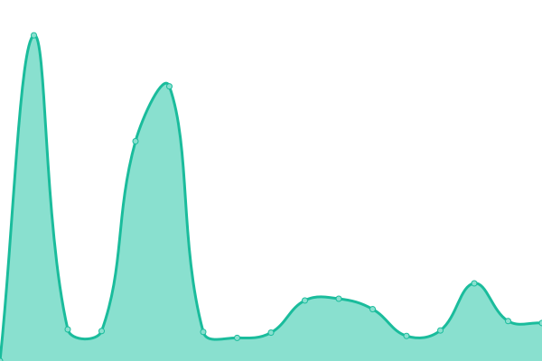
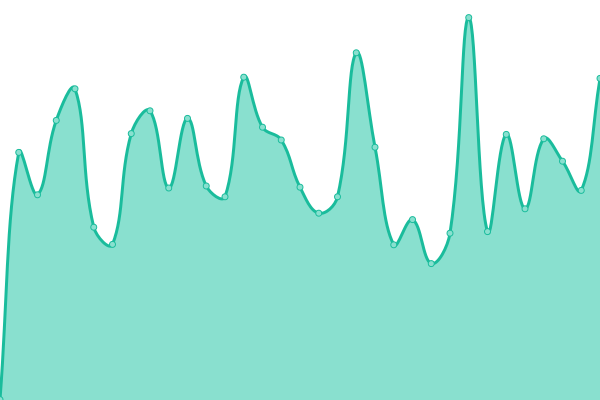

# [📈 Live Status](https://jeanp94.github.io/server): <!--live status--> **🟧 Partial outage**

This repository contains the open-source uptime monitor and status page for [jeanp94](https://jeanp94.github.io/server), powered by [Upptime](https://github.com/upptime/upptime).

With [Upptime](https://upptime.js.org), you can get your own unlimited and free uptime monitor and status page, powered entirely by a GitHub repository. We use [Issues](https://github.com/jeanp94/server/issues) as incident reports, [Actions](https://github.com/jeanp94/server/actions) as uptime monitors, and [Pages](https://jeanp94.github.io/server) for the status page.

<!--start: status pages-->
<!-- This summary is generated by Upptime (https://github.com/upptime/upptime) -->
<!-- Do not edit this manually, your changes will be overwritten -->
<!-- prettier-ignore -->
| URL | Status | History | Response Time | Uptime |
| --- | ------ | ------- | ------------- | ------ |
|  [Google](https://www.google.com) | 🟩 Up | [google.yml](https://github.com/jeanp94/server/commits/HEAD/history/google.yml) | 

 116ms
     
 | 

<a href="https://jeanp94.github.io/server/history/google">100.00%</a>
    

|  [kayser](https://www.kayser.pe) | 🟩 Up | [kayser.yml](https://github.com/jeanp94/server/commits/HEAD/history/kayser.yml) | 

 3156ms
     
 | 

<a href="https://jeanp94.github.io/server/history/kayser">100.00%</a>
    

|  [promotoras kayser](https://www.promotoraskayser.pe) | 🟩 Up | [promotoras-kayser.yml](https://github.com/jeanp94/server/commits/HEAD/history/promotoras-kayser.yml) | 

 968ms
     
 | 

<a href="https://jeanp94.github.io/server/history/promotoras-kayser">100.00%</a>
    

|  [kayser contigo](https://kaysercontigo.pe) | 🟩 Up | [kayser-contigo.yml](https://github.com/jeanp94/server/commits/HEAD/history/kayser-contigo.yml) | 

 2629ms
     
 | 

<a href="https://jeanp94.github.io/server/history/kayser-contigo">99.20%</a>
    

|  [monark](https://www.monark.com.pe) | 🟩 Up | [monark.yml](https://github.com/jeanp94/server/commits/HEAD/history/monark.yml) | 

 582ms
     
 | 

<a href="https://jeanp94.github.io/server/history/monark">100.00%</a>
    

|  [Siempre conectado HP](https://www.siempreconectado.pe) | 🟥 Down | [siempre-conectado-hp.yml](https://github.com/jeanp94/server/commits/HEAD/history/siempre-conectado-hp.yml) | 

 0ms
     
 | 

<a href="https://jeanp94.github.io/server/history/siempre-conectado-hp">0.00%</a>
    

|  [Distribuidora Navarrete](https://www.distribuidoranavarrete.com.pe) | 🟩 Up | [distribuidora-navarrete.yml](https://github.com/jeanp94/server/commits/HEAD/history/distribuidora-navarrete.yml) | 

 2593ms
     
 | 

<a href="https://jeanp94.github.io/server/history/distribuidora-navarrete">100.00%</a>
    

|  [Jafi Bike](https://www.jafibike.com.pe) | 🟩 Up | [jafi-bike.yml](https://github.com/jeanp94/server/commits/HEAD/history/jafi-bike.yml) | 

 303ms
     
 | 

<a href="https://jeanp94.github.io/server/history/jafi-bike">100.00%</a>
    

|  [Consultoria](https://www.dyj-consultores.com.pe) | 🟩 Up | [consultoria.yml](https://github.com/jeanp94/server/commits/HEAD/history/consultoria.yml) | 

 653ms
     
 | 

<a href="https://jeanp94.github.io/server/history/consultoria">100.00%</a>
    

|  [Cama Clinica](https://www.camaclinica.pe) | 🟩 Up | [cama-clinica.yml](https://github.com/jeanp94/server/commits/HEAD/history/cama-clinica.yml) | 

 455ms
     
 | 

<a href="https://jeanp94.github.io/server/history/cama-clinica">100.00%</a>
    

|  [HPimprime](https://imprimeloqueamas.com) | 🟥 Down | [h-pimprime.yml](https://github.com/jeanp94/server/commits/HEAD/history/h-pimprime.yml) | 

 0ms
     
 | 

<a href="https://jeanp94.github.io/server/history/h-pimprime">0.00%</a>
    

<!--end: status pages-->

[**Visit our status website →**](https://jeanp94.github.io/server)

## 📄 License

- Powered by: [Upptime](https://github.com/upptime/upptime)
- Code: [MIT](./LICENSE) © [jeanp94](https://jeanp94.github.io/server)
- Data in the `./history` directory: [Open Database License](https://opendatacommons.org/licenses/odbl/1-0/)
